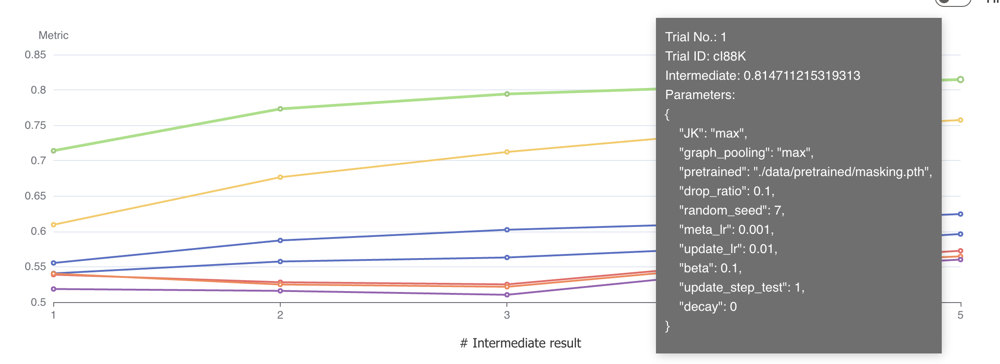

# MolFeSCue: Enhancing Molecular Property Prediction in Data-Limited and Imbalanced Contexts using Few-Shot and Contrastive Learning

## Introduction
This is the source code and dataset for the above paper. If you have any questions, please contact [zrc720@gmail.com](zrc720@gmail.com)

This study addresses the challenge of predicting molecular properties, a crucial task in fields like drug discovery, material science, and computational chemistry. The main obstacles in this area are the scarcity of annotated data and the imbalance in class distributions, which complicate the development of accurate and robust predictive models. To overcome these challenges, the study introduces the MolFeSCue framework, which integrates pre-trained molecular models within a few-shot learning approach. A key feature of this framework is the use of a novel dynamic contrastive loss function, designed to enhance model performance, particularly in situations with class imbalance. MolFeSCue stands out for its ability to quickly generalize from a limited number of samples and its effective use of the contrastive loss function to derive meaningful molecular representations from imbalanced datasets. 

## Create environment
```
conda env create -f environment.yaml
```

## Create Dataset

The original datasets are downloaded from [Data](http://snap.stanford.edu/gnn-pretrain/data/chem_dataset.zip). We utilize data/splitdata.py to split the datasets according to the molecular properties and save them in different files in the data/[DatasetName]/new.

```python
cd data && python splitdata.py
```

## Training 
```
python train_fewshot.py
```

## Reproduce the results

1. The 10-shot setting for sider dataset can be reproduced by running the following hyperparameters. You need to modify the config file to the following settings:
```
model:
  backbone: gnn # seq, gnn
  gnn:
    pretrained: "./data/pretrained/masking.pth"
    gnn_type: gin
    num_layer: 5
    emb_dim: 300
    JK: max
    dropout_ratio: 0.1
    graph_pooling: max
    JK_coo_attention: max
meta:
  num_atoms: 119
  selfsupervised_weight: 0
  contrastive_weight: 0.1
  alpha_s: 1
  alpha_e: 0.2
  beta: 0.1

train:
  random_seed: 7
  epochs: 3000
  batch_size: 128
  meta_lr: 0.001
  update_lr: 0.01
  decay: 0
  update_step: 1
  update_step_test: 1
  eval_epoch: 50
```
2. Check the reproduce log file in the `./outputs/2024-06-06/20-26-47` folder 

## NNI for hyperparameter tuning

Due to the problem setting of few-shot learning, models are often very sensitive to parameters. MolFesCue does not have any magical hyperparameters, and regular parameter settings can achieve ideal results. If you want to obtain better results, you can use NNI for parameter search.

1. config the `conf/search_space.json` file for the search space.
2. modify the `config.yaml` file to use the NNI tuner.
```
mode:
  nni: true
```
3. Run the following command to start the NNI tuner.
```
nnictl create --config config.yaml --port 8080
```
4. Open the browser to check the results.
   


## Launch MLFlow

1. If you want to use MLFlow to track the experiments, you can launch the MLFlow server by running the following command:

```python
mlflow server --default-artifact-root file://./mlruns --host 0.0.0.0 --port 5055
```
2. Set the environment variable:
```
MLFLOW_TRACKING_URI: http://127.0.0.1:5055
MLFLOW_EXPERIMENT_NAME: "FSADMET"
REGISTERED_MODEL_NAME: "fsadmet"
```
3. Modify config file to enable MLFlow when training the model. 
```
logger:
  log: true
```

## Reference
1. We use the code from project [Meta-MGNN](https://github.com/zhichunguo/Meta-MGNN). Thanks for their contribution.
2. We use pretrained model from Project [Snap Stanford](https://github.com/snap-stanford/pretrain-gnns/tree/master/chem/model_gin) and [ChemBERTa](https://huggingface.co/seyonec/ChemBERTa-zinc-base-v1). Thanks for their contribution.
